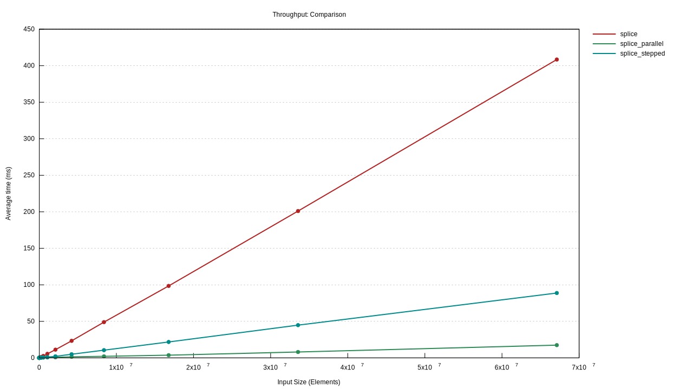
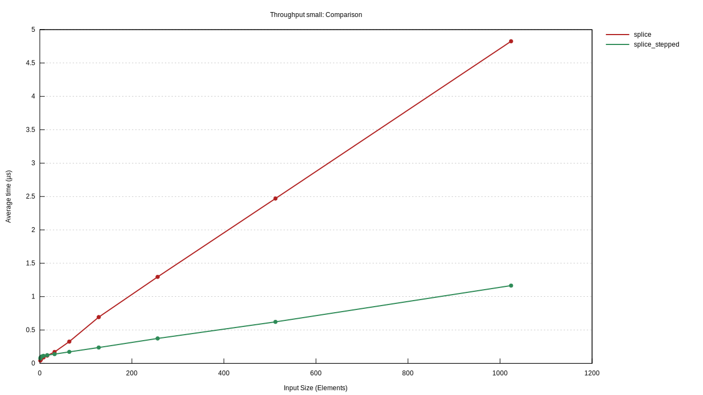

# Benchmarks for extracting data by strides using Rust

Motivated by the Reddit thread
<https://reddit.com/r/rust/comments/xcge4u/any_efficient_way_of_splitting_vector/>,
this code benchmarks various solutions for partitioning bytes in an array
by different strides.
Essentially, the problem involves

* taking an array of bytes:

      [1 2 3 4 5 6 7 8 9 10 11]

* arranging it in a matrix according to the desired number of output channels:

       1  2  3
       4  5  6
       7  8  9
      10 11

* and then collecting each column into an array:

      [1 4 7 10]
      [2 5 8 11]
      [3 6 9]

There were three alternative implementations being compared:

* `splice`, an imperative solution
* `splice_stepped`, using iterators that assemble the output in multiple passes
* `splice_parallel`, the iterator-based solution but parallelized with Rayon

**Methodological limitation:**
while input size was varied,
the number of output channels was held constant at `5**.

**Findings at a glance:**
for different input sizes, different solutions were optimal:

| input size   | best implementation                          |
|--------------|----------------------------------------------|
| <32B         | `splice` imperative solution                 |
| 32B to 512KB | `splice_stepped` iterator solution           |
| ≥512KB       | `splice_parallel` parallel iterator solution |

## Methodology

The different implementations
(see [Implementations in detail](#implementations-in-detail))
were benchmarked against each other
using the [Criterion.rs framework](https://github.com/bheisler/criterion.rs).

The benchmarks varied the input size between 1B and 64MB in powers of two
(2^0, 2^1, 2^2, 2^3, …, 2^26).
As input data, a counter modulo 256 was used to fill the input array.

For all benchmarks, the number of output channels was held fix at 5 output vectors.
Since this is not a power of 2,
it should lead to access patterns that can't easily be optimized away
(e.g. in contrast to selecting every 4th or 8th byte).

## Results and Discussion

Zooming out to the entire data series,
we get the following diagram showing time per iteration
as a function of the input size.
Lower time per iteration is better.



We can see that at large input sizes,
the imperative `splice` implementation is slowest by far,
whereas the multi-threaded `splice_parallel` implementation scales quite well.
But due to the linear scale of the x-axis,
it is difficult to see behaviour around small input sizes.

Additional data was collected for small input sizes (until 1KB),
comparing only the imperative `splice` with the iterator-based `splice_stepped` solutions:



In most of this region, the `splice` imperative solution performs clearly slower.
Only at very small input sizes do we see that the imperative solution outperforms the iterators.

The following table provides average throughput numbers at selected input sizes.
Throughput is the inverse of the speed shown in the previous plots,
so that higher is better.

| size  | `splice` | `splice_stepped` | `splice_parallel` |
|-------|----------|------------------|-------------------|
| 2B    | 33MB/s   | 22MB/s           | 49KB/s            |
| 32B   | 185MB/s  | 230MB/s          | 385KB/s           |
| 64KB  | 213MB/s  | 975MB/s          | 191MB/s           |
| 512KB | 202MB/s  | 993MB/s          | 1.0GB/s           |
| 64MB  | 164MB/s  | 756MB/s          | 3.8GB/s           |

Interpretations:

* Even at tiny input sizes,
  iterators are only slower by a factor of 1.5× compared to the imperative solution.
  It is thus worth using them by default,
  unless it is known that the input data will contain mostly <32B inputs.

* While the iterator based solutions must go through the data multiple times
  (in this benchmark: 5 times),
  this seems to be faster at large input sizes than using imperative coding patterns.

  In Rust, this is likely due to bounds checking,
  e.g. in the line `out[i % channels].push(d)`.
  Three expensive-ish things are going on here:

  * a modulo operator
  * an array access, which requires bounds checking
  * pushing to a vector, which requires a check that the vector has sufficient capacity

* Both single-threaded solutions top out their throughput
  around the size of the per-core L2 cache,
  and drop off afterwards.
  The multithreaded solution is not constrained by per-core cache effects
  and continues to improve throughput as the input data grows larger.

* The multithreaded solutions suffers from substantial overhead at small input sizes,
  being about 1000× times slower when only dealing with individual bytes.
  However, this overhead is amortized at larger inputs.
  The multithreaded approach starts being competitive with the imperative approach
  at input sizes beyond 64KB.

## Limitations and future work

The analysis only proceeds along the single axis “input size”,
and there only in large steps (powers of 2).
Further analysis would be needed to understand the impact of the number of output channels.
Smaller step sizes
or dynamic sampling using Bayesian methods like a Gaussian Process Regression
could help t understand the behaviour around breaking points more closely.

The analysis was performed on a single CPU architecture.
Comparing with other CPU architectures
might help to understand the real-world differences between the tested algorithms.


## Implementations in detail

### `splice`, the imperative solution

```rust
#[inline]
pub fn splice(channels: usize, data: &[u8]) -> Vec<Vec<u8>> {
    assert!(channels > 0);
    let each_len = data.len() / channels + if data.len() % channels == 0 { 0 } else { 1 };
    let mut out = vec![Vec::with_capacity(each_len); channels];
    for (i, d) in data.iter().copied().enumerate() {
        out[i % channels].push(d);
    }
    out
}
```

This solution pre-allocates enough space for each output vector.
Then, it iterates through each input element and pushes it onto the correct output vector.

### `splice_stepped`, the iterator-based solution

```rust
#[inline]
pub fn splice_stepped(channels: usize, data: &[u8]) -> Vec<Vec<u8>> {
    assert!(channels > 0);
    (0..channels)
        .map(|offset| {
            data.iter()
                .copied()
                .skip(offset)
                .step_by(channels)
                .collect()
        })
        .collect()
}
```

This approach turns the loops inside out:
we iterate over each output vector.
To create each output vector, we skip over *n* elements and then pick every *n*th element.

Going into these benchmarks, I expected performance of this approach to be competitive
since iterating through an array and then reading data at regular offsets
is an extremely common operation, for example when using an Array of Structs data structure
and extracting struct fields.

### `splice_parallel`, the parallelized iterator solution

```rust
use rayon::prelude::*;

#[inline]
pub fn splice_parallel(channels: usize, data: &[u8]) -> Vec<Vec<u8>> {
    assert!(channels > 0);
    (0..channels)
        .map(|offset| {
            data.par_iter()
                .copied()
                .skip(offset)
                .step_by(channels)
                .collect()
        })
        .collect()
}
```

This is identical to the iterator based solution,
except that we use a parallel iterator on the outer loop.
This means that each output vector is built in parallel,
with each thread iterating through the data independently.

## The benchmark system

Such benchmarks are rather hardware-sensitive.
The benchmarks were conducted with a Ryzen 3900X Zen2 CPU
which has a somewhat unusual architecture:

* 4 core complexes
  * L3 cache: 16MB (64MB total)
  * 3 cores (12 total)
    * L2 cache: 512KB (6MB total)
    * L1d cache: 32KB (384KB total)
    * 2 threads per core (24 total)

The cache sizes may correlate with break-even points
where different implementations become optimal.

* The 32B break-even point between the imperative and iterator-based solution
  happens to correspond to the size of a cache line.
  However, this might be a coincidence.

* The 512KB break-even point between the single-threaded and parallelized iterators
  corresponds exactly to the size of the L2 cache.
  Possible interpretation:
  as the data has difficulty fitting into one core's L2 cache,
  using multiple cores becomes attractive.
